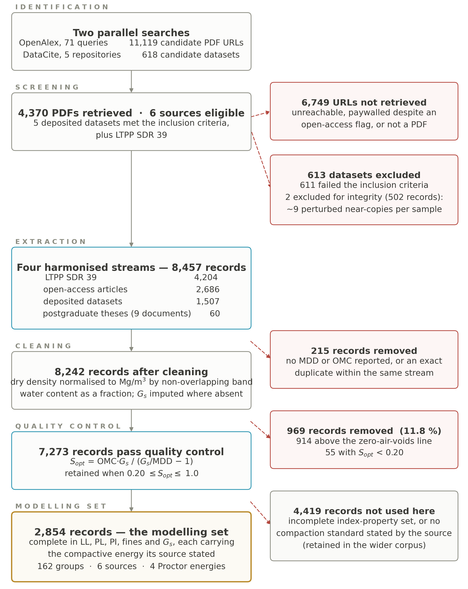
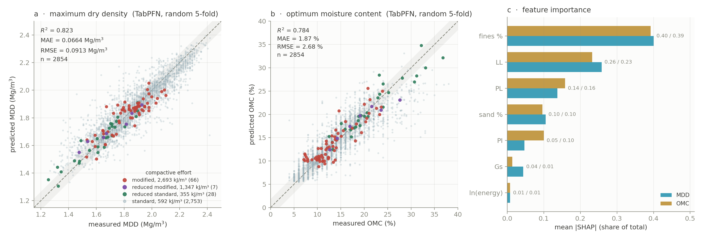
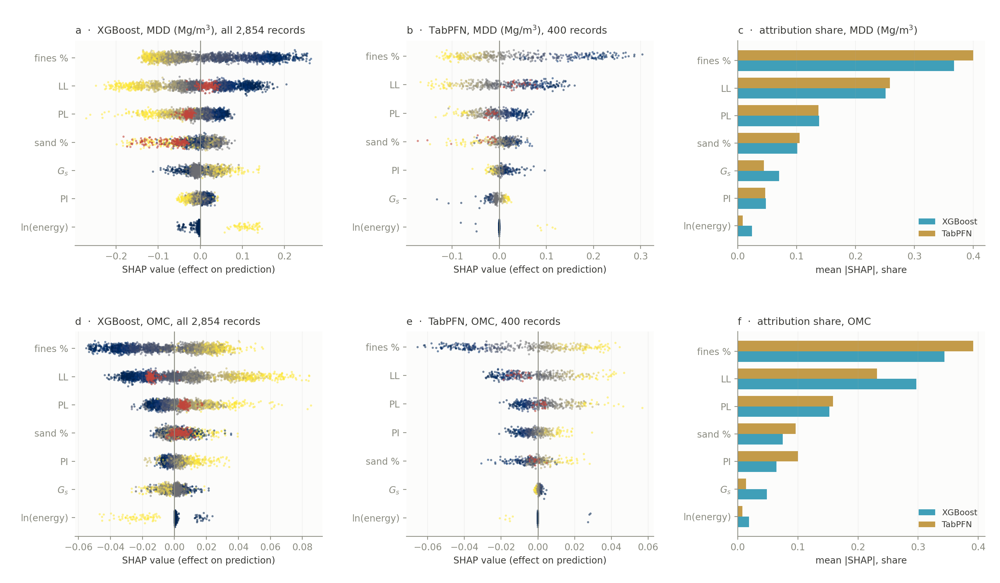

# An open dataset of soil compaction tests

**2,854 Proctor compaction tests** assembled from six public sources, each
record complete in the index properties required for modelling and each
carrying the compactive energy its source stated — spanning four Proctor
energy levels from 355 to 2,693 kJ/m³ and both sides of the coarse/fine
boundary.

A wider pool of **7,273 quality-controlled records** and **90 digitised
compaction curves (1,048 measured points)** are released alongside it.

Every record carries its originating source, so any evaluation can respect
provenance rather than treating records from one laboratory as independent.

**Trained weights ship with the data.** `predict.py` predicts maximum dry
density and optimum moisture content for a soil you describe, from boosters
fitted on all 2,854 records — see [Predict a soil](#predict-a-soil).

---

## Why this exists

Correlations predicting maximum dry density (MDD) and optimum moisture content
(OMC) from index properties have been published for four decades. They rest on
datasets of one to four hundred specimens, usually from a single laboratory,
almost always at a single compactive energy, and almost never released. Four
decades of correlations have therefore accumulated that cannot be compared with
one another, because no two rest on the same soils.

This dataset is an attempt to fix the input side of that problem.

## What is here



*How the two released datasets were assembled. The principal flow runs down the
left; exclusions branch to the right with the count and the reason. 11,119
candidate URLs and 618 candidate datasets reduce to four harmonised streams of
8,457 records, then to the 7,273 that pass the zero-air-voids admissibility
check — released as `compaction_parameters_full.csv` — and finally to the 2,854
complete in every input the model needs, released as
`compaction_parameters.csv`. This is Figure 1 of the accompanying paper.*

| File | Records | Content |
|---|---|---|
| `data/compaction_parameters.csv` | 2,854 | **The modelling dataset.** Complete in PI, fines, energy and Gs; no imputation of soil properties. This is the file the accompanying paper reports on. |
| `data/compaction_parameters_full.csv` | 7,273 | The wider pool: every record passing the admissibility filter, including those with incomplete property sets. Impose your own completeness requirement rather than inheriting ours. |
| `data/curve_points.csv` | 1,048 | Digitised (water content, dry density) points forming 90 complete compaction curves |
| `data/curve_parameters.csv` | 90 | Four-parameter fits of those curves, with identifiability flags |
| `data/sources.csv` | 6 | Provenance, licence and record counts per source |
| `data/references.csv` | 378 | Per-record citation |
| `models/model_mdd.json` | — | **Trained weights for maximum dry density.** Gradient-boosted, fitted on all 2,854 records |
| `models/model_omc.json` | — | **Trained weights for optimum moisture content.** Same records, same configuration |
| `models/model_meta.json` | — | Input order, hyperparameters and the out-of-fold accuracy of both, so the weights never travel without their honest performance |
| `models/source_pfn.csv` | 2,854 | **The TabPFN artefact.** The dataset prepared as the context the model predicts from: the six inputs in order with energy already logged, plus the two targets, and no identifier or liquid-limit column |
| `models/tabpfn_meta.json` | — | The record for that model, which has no weights by construction — the context path, its digest, the input order and the out-of-fold accuracy |
| `predict.py` | — | **The command-line predictor.** Loads the weights and applies them to soils you supply |
| `examples/example_soils.csv` | 6 | Worked input for the batch mode of `predict.py` |

Field definitions, units and derivations: **[`docs/DATA_DICTIONARY.md`](docs/DATA_DICTIONARY.md)**.

### Columns of the modelling dataset

| Column | Meaning | Unit |
|---|---|---|
| `LL`, `PL`, `PI` | liquid limit, plastic limit, plasticity index | % |
| `fines_pct`, `sand_pct` | fraction passing 0.075 mm; sand fraction | % |
| `energy_kJm3` | compactive energy as stated by the source | kJ/m³ |
| `Gs` | specific gravity of solids | — |
| `MDD_Mgm3` | maximum dry density | Mg/m³ |
| `OMC_frac` | optimum moisture content | **decimal fraction** |
| `group` | the unit a cross-validation split should respect | — |
| `record_id`, `source`, `test_standard` | provenance | — |

Two columns carry **deliberate gaps**, and they should be left as they are:

- `sand_pct` is absent on 169 records. Every record in the corpus reporting a
  non-standard compactive effort omits the sand fraction, so requiring it would
  delete all four-energy coverage. Gradient-boosted trees and several other
  learners accept the gaps directly.
- `LL` and `PL` are absent on 134 records. These are non-plastic soils, for
  which the Atterberg tests do not apply; `PI = 0` records the fact that
  matters. The published values for these soils are placeholders — 113 report a
  plastic limit above the liquid limit, which cannot be true — so they were
  removed rather than propagated.

## Predict a soil

The weights in `models/` are the artefact of the accompanying paper: two
gradient-boosted models, one per target, fitted on every record here with
hyperparameters fixed in advance rather than searched. `predict.py` applies
them.

```bash
pip install -r requirements.txt
```

**One soil.** Give the index properties you have and the Proctor standard:

```bash
python predict.py --ll 38 --pl 20 --fines 72 --sand 25 --gs 2.70 --effort SP
```

```
soil 1
  MDD  1.793 Mg/m3    +/- 0.068 out-of-fold MAE
  OMC  16.90 %          +/- 1.88 out-of-fold MAE
  degree of saturation at optimum 0.902

The MAE above is the random-fold figure. For a soil from a source the model
has not seen, expect 0.088 Mg/m3 and 2.36 % instead (models/*_meta.json, transfer).
```

**Many soils.** A CSV carrying the input columns, with `test_standard` or
`energy_kJm3` for the effort:

```bash
python predict.py --csv examples/example_soils.csv --out predictions.csv
```

**Machine-readable.** `--json` writes the model name, the predictions and the
accuracy figures to stdout in either mode.

### Which model

| | `--model xgboost` (default) | `--model tabpfn` |
|---|---|---|
| MDD R², random folds | 0.819 at 0.068 Mg/m³ | **0.824 at 0.066** |
| OMC R², random folds | 0.783 at 1.88 % | **0.784 at 1.87** |
| MDD R², grouped folds | 0.722 at 0.088 Mg/m³ | **0.727 at 0.086** |
| OMC R², grouped folds | 0.681 at 2.36 % | **0.696 at 2.28** |
| MDD R², source held out | 0.392 at 0.127 Mg/m³ | **0.520 at 0.116** |
| OMC R², source held out | 0.225 at 3.53 % | **0.614 at 2.76** |
| Impossible pairs, of 2,854 | 7 | **1** |
| Time per call | a fraction of a second | **~5 minutes on CPU** |
| Install | `requirements.txt`, three packages | plus `requirements-tabpfn.txt` — torch, and a checkpoint downloaded on first use |

TabPFN is the paper's leading model and the one Sections 5.2–5.5 are reported
with, so it is offered here. It ships **no weights**, and cannot: it predicts by
in-context learning, taking no gradient step on this dataset at all, so the
2,854 records are supplied as context and the query read off in a single forward
pass.

**`models/source_pfn.csv` is what it loads**, and stands in the same relation to
TabPFN as `model_mdd.json` does to the boosters — change it and you have changed
the model. It is the dataset prepared: the six inputs in the order the model
expects them, compactive energy already converted to its natural logarithm, the
two targets, the documented gaps carried through as blanks, and deliberately no
`LL`, `record_id`, `source` or `group`, so that neither an identifier nor a
held-out column can reach the model as a feature. `predict.py` checks it against the digest in `models/tabpfn_meta.json`
before running, and refuses rather than quoting an accuracy that would describe
a different model. Rebuild it from the dataset at any time:

```bash
python scripts/build_source_pfn.py
```

The default is the gradient-boosted model because the two are not distinguishable
in accuracy on these data — 0.005 in R², against a between-fold dispersion of
0.006 to 0.017 — while they differ by three orders of magnitude in cost. On a
lean clay the two return 1.793 against 1.776 Mg/m³ and 16.90 against 16.55 %,
differences an order of magnitude inside their own error bars. Where the choice
does matter is physical admissibility: TabPFN implies an impossible degree of
saturation five times less often, which is why the paper carries it through.
Reach for it when a prediction sits near the zero-air-voids line, or when a
handful of soils justifies the wait.

### What the inputs are

| Flag | Column | Unit | |
|---|---|---|---|
| `--ll` | `LL` | % | liquid limit; **not a model input**, used only to derive `PI` |
| `--pl` | `PL` | % | plastic limit; omit for a non-plastic soil |
| `--pi` | `PI` | % | plasticity index; **derived as LL − PL** when both are given, so pass it only for a non-plastic soil, as `0` |
| `--fines` | `fines_pct` | % | passing 0.075 mm; **required** |
| `--sand` | `sand_pct` | % | sand fraction; may be omitted |
| `--gs` | `Gs` | — | specific gravity; defaults to 2.68, the corpus median |
| `--effort` | `test_standard` | — | `SP`, `MP`, `RSP` or `RMP` |
| `--energy` | `energy_kJm3` | kJ/m³ | an alternative to `--effort`, for an effort not on the list |

Energy enters the model as its natural logarithm; `predict.py` takes kJ/m³ and
converts, so never pass a logarithm. `PL` and `sand_pct` may be left blank: the
boosters were fitted with those gaps present, for the reasons above, and route a
blank down a learned default branch. Everything else is required.

The model reads six inputs, and the liquid limit is not among them. Only two of
the three consistency limits are algebraically independent, and carrying the
third costs 0.041 in R² for density on a source the model has not seen, so `LL`
is released with the dataset and held out of the mapping. `predict.py` still
accepts it and uses it to derive `PI` as `LL − PL` and to reject `PL` above
`LL`. Passing `LL` alone, with no `PL` and no `PI`, therefore no longer informs
the prediction.

### How good is it



*Every record predicted once while held out, under random five-fold
cross-validation on the six inputs. (a) maximum dry density and (b) optimum
moisture content, the dashed line being equality and the grey band ±1 mean
absolute error; points are coloured by compactive effort, with the 101
non-standard records drawn larger since at 3.5 % of the dataset they would
otherwise vanish into the standard-effort cloud. (c) mean |SHAP| as a share of
the total, for both targets. This is Figure 5 of the accompanying paper.*

Each point is a prediction for a record the model did not see. The scatter is
what R² 0.824 and 0.784 look like — close enough to be useful, wide enough that
a single prediction should not be read to three decimal places. The panels are
TabPFN; the default boosters sit 0.005 behind, a gap invisible at this scale.
Read the caveat below before quoting these two numbers: they are random-fold
figures, and a soil from a source the model has not seen is harder.

Two things worth reading off it. The four compactive efforts fall on the same
line rather than forming separate bands, which is what justifies fitting them as
one model with energy as an input rather than one model per standard. And the
error is roughly proportional across the range rather than concentrated at
either end, so the ±1 MAE band quoted beside every prediction is a fair summary
wherever your soil sits.

### What comes back, and what to trust

Each prediction carries the degree of saturation it implies at the peak, and a
flag when that exceeds unity — the pair then plots above the zero-air-voids line
and describes a soil that cannot exist. Under random five-fold
cross-validation this happens for 7 of the 2,854 records with the boosters and 1
with TabPFN; it happens more often when the inputs are far from the
corpus, and inputs outside the range the corpus spans are flagged as
extrapolation.

**Quote the out-of-fold accuracy, not the fit.** Under random five-fold
cross-validation the released hyperparameters give R² 0.819 for density at
0.068 Mg/m³ and 0.783 for the optimum at 1.88 % water content, and TabPFN 0.824
and 0.784. The weights shipped here were then refitted on all 2,854 records with
nothing held back, so what they score on their own training data is not an
estimate of anything.

**Then quote the transfer figure instead.** Those random-fold numbers measure
how well the corpus interpolates within itself: under a random split 96.6 % of
records share a provenance group with their training fold, and 40.1 % share an
exact input vector. With folds blocked on the 162 provenance groups, at an
unchanged training-set size, the boosters give 0.722 and 0.681, and TabPFN 0.727
and 0.696. With a whole source held out they give 0.392 and 0.225, and TabPFN
0.520 and 0.614. If your soil comes from a laboratory or a study the corpus does
not contain, those are the figures that apply.

All three sets are recorded in `models/model_meta.json` and
`models/tabpfn_meta.json`, under `cross_validated` and `transfer`, and the first
two are reported alongside every prediction. One further caution: the prediction
is of the peak alone, not of the curve either side of it.

Regenerate either artefact from the released data at any time:

```bash
python scripts/train_model.py        # models/model_mdd.json, model_omc.json
python scripts/build_source_pfn.py   # models/source_pfn.csv
```

### What drives the prediction



*Panel (c) above, opened up and extended to both models. (a, d) XGBoost, exact
TreeSHAP over all 2,854 records; (b, e) TabPFN, permutation estimate over 400;
(c, f) mean |SHAP| as a share of the total. In the beeswarm panels each point is
one record, placed by its SHAP value and coloured by the feature's own value,
low to high. This is Figure 7 of the accompanying paper.*

Fines content and the liquid limit carry roughly two-thirds of the attribution
on both targets, and the two models agree on the ordering at a Spearman
coefficient of 0.96 — which is the useful thing to know before trusting a
prediction: **a soil whose fines content or liquid limit you are unsure of is a
soil the prediction is unsure of.** Specific gravity and the plasticity index
contribute little, so the 2.68 default for `--gs` costs less than it might
appear.

`ln(energy)` looks negligible in the attribution share, and is not. Only 101
records of 2,854, 3.5 %, sit at a non-standard compactive effort, so a mean
absolute Shapley value over the whole dataset is dominated by the 96.5 % where
the input does not vary. Panels (a) and (d) show what it does when it does
vary — the yellow points, high energy, sit clearly apart from the rest. Compare
the two efforts on one soil and the difference is 0.17 Mg/m³ and 3.5 % water
content, which is not a small effect.

## Fit your own model

```python
import pandas as pd, numpy as np

d = pd.read_csv("data/compaction_parameters.csv")
d["log_energy"] = np.log(d.energy_kJm3)

X = d[["PL", "PI", "fines_pct", "sand_pct", "log_energy", "Gs"]]
y_density  = d.MDD_Mgm3      # Mg/m3
y_moisture = d.OMC_frac      # fraction, multiply by 100 for percent
```

**Group your folds.** LTPP contributes 1,976 records naming 905 distinct test
sections, which are not independent publications. A random split places
near-duplicate soils from one laboratory on both sides of the partition. Use
`GroupKFold` on `group` if you want an estimate of performance on a source the
model has not seen; a random split answers a different and easier question, and
in our hands the two differ by roughly 0.10 in R².

**What to beat.** Under the random five-fold split, the accompanying paper
reports R² 0.824 for density from TabPFN, 0.819 from the gradient-boosted model
released here and 0.791 from a multilayer perceptron — three model classes
within 0.03 of one another, on identical folds. A nested search over nine
hyperparameters of the ensemble recovered nothing over the values fixed a
priori. The ceiling looks like a property of the data rather than of the
learner, so the return on a further algorithm is probably small; the return on
more records, or on the curve either side of the peak, is not.

## Quality control

Physical admissibility is assessed through the degree of saturation implied at
the compaction peak. With ρ_w = 1 Mg/m³,

```
e     = Gs / MDD − 1
S_opt = OMC · Gs / e
```

A record with `S_opt > 1` plots above the zero-air-voids line and is impossible
as published. Records are retained where `0.20 ≤ S_opt ≤ 1.0`, MDD lies in
0.8–2.6 Mg/m³ and OMC in 1–70 %.

**Of 8,242 harmonised records, 969 (11.8 %) failed** — 914 above the
zero-air-voids line, 55 below the lower bound. Roughly one published compaction
record in nine, taken at face value, describes a soil that cannot exist. The
rate is far higher among records extracted from the literature than among
deposited datasets, which is the argument for applying the check as a filter
rather than reporting it as a diagnostic.

Two deposited datasets that met every inclusion criterion were **excluded for
integrity**: in each, every apparently genuine specimen is followed by roughly
nine near-copies perturbed in the fourth to sixth decimal place, and 194 of 199
records in one of them plot above the zero-air-voids line.

Verify the release:

```bash
shasum -a 256 -c CHECKSUMS.sha256
python scripts/validate_corpus.py
```

## Sources

| # | Source | Region | Licence |
|---|---|---|---|
| 1 | [LTPP Standard Data Release 39](https://infopave.fhwa.dot.gov/Data/StandardDataRelease), Material Test volume | United States | US federal public domain |
| 2 | [Soranzo (2024)](https://doi.org/10.5281/zenodo.14251190), geotechnical database | Austria | CC BY 4.0 |
| 3 | [Geotechnical Properties of Soils: A Dataset from Literature (2025)](https://doi.org/10.6084/m9.figshare.28681187) | multi-source | CC BY 4.0 |
| 4 | [Geotechnical Properties and CBR Values, Türkiye (2026)](https://doi.org/10.5281/zenodo.20737270) | Türkiye | CC BY 4.0 |
| 5 | [Compaction Characteristics Data (2026)](https://doi.org/10.6084/m9.figshare.32955851) — the only source spanning more than one compactive energy | multi-source | CC BY 4.0 |
| 6 | [Biopolymer-stabilised soils (2026)](https://doi.org/10.5281/zenodo.19242689), untreated parent soils only | multi-source | CC BY 4.0 |

If you use this dataset, **cite the original sources as well as this
compilation**. Per-record citations are in `data/references.csv`.

## What is not here

**Complete compaction curves, at scale.** No public repository holds them. The
four to six measured points are discarded at publication and only the peak
reported; this is explicitly true of LTPP, whose documentation states that the
points other than the peak are not loaded into the database. The 90 curves in
`data/curve_points.csv` were recovered by digitising figures, and are the
exception rather than the rule.

**Laboratory data from national databases.** The British Geological Survey
National Geotechnical Properties Database defines AGS4 groups for compaction
points and parameters and exposes 72,849 boreholes through an open API, but a
random sample of 600 boreholes returned 57 project files containing no
compaction or Atterberg group whatever. The public export carries borehole logs
only; laboratory data requires a licence.

## Changes in 2.2.0

The dataset is unchanged. The released model is not.

- **The model now reads six inputs, not seven.** The liquid limit has been
  removed from the input set. Only two of the three consistency limits are
  algebraically independent, and carrying the third costs 0.041 in R² for
  density on a source the model has not seen. `LL` is still released with the
  dataset, and `predict.py` still accepts it to derive `PI`, but it no longer
  reaches the model. Code that loads `models/model_mdd.json` directly must drop
  the `LL` column, in the order given in `docs/DATA_DICTIONARY.md`.
- **New weights.** `models/model_mdd.json`, `models/model_omc.json` and
  `models/source_pfn.csv` were regenerated on the six inputs by
  `scripts/train_model.py` and `scripts/build_source_pfn.py`.
- **Transfer accuracy is now recorded and reported.** `model_meta.json` and
  `tabpfn_meta.json` gained a `transfer` block holding the grouped-fold and
  source-held-out scores, and a `zav_violations` count. `predict.py` prints the
  grouped figure beside the random one, because the random figure is an
  interpolation figure and overstates what to expect on a new soil.
- Accuracy figures throughout were refreshed to the six-input model.

## Limitations

- **Energy coverage is thin and confounded.** Four levels are present, but only
  101 records (3.5 %) are at non-standard effort and all derive from a single
  curated source.
- **One programme supplies 69 % of records.** LTPP is laboratory data from one
  programme under one protocol.
- **Only the peak is modelled** in the main dataset. The curve either side of
  optimum — which determines the acceptable water-content window on site — is
  present for 90 soils only.
- **Gs is imputed on most records** at 2.68, the corpus median of measured
  values, and propagates into the derived `S_opt`.
- **Geographic imbalance.** The United States, Türkiye and Austria predominate;
  tropical residual, volcanic and temperate glacial soils are sparse.

## Licence

[CC BY 4.0](LICENSE). Individual sources carry their own terms, recorded in
`data/sources.csv`; all are CC BY 4.0 or public domain.
